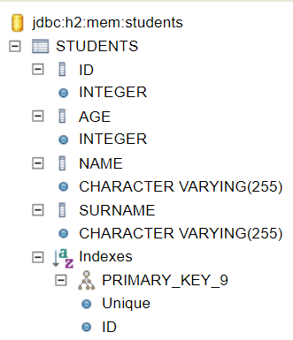
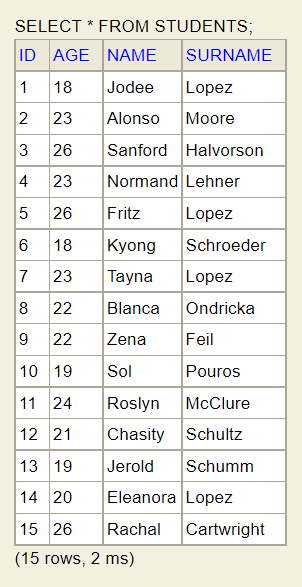
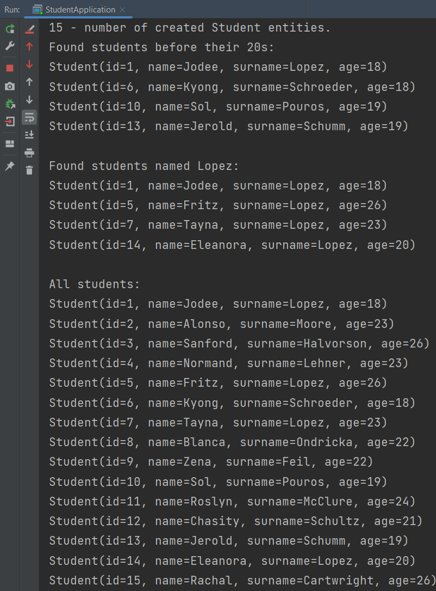
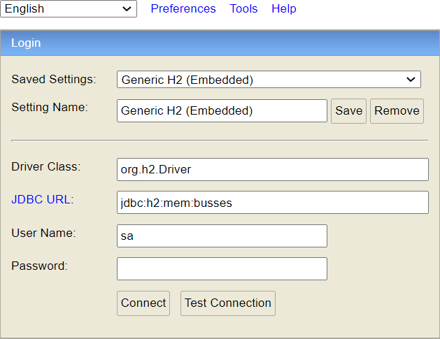

# INTERNSHIP ADB

<p align="justify">
The present repository you browse contains projects that are outcome of my work placement 
(as a part of my first-cycle studies) in <b>ADB POLSKA SP. Z O.O. (ZIELONA GORA OFFICE)</b> 
that took place in <b>July 2021</b>. In the process of work placement I have been introduced to foundations of 
<code>Spring framework</code>. The culmination of work was to implement <b>Representational state transfer application 
programming interface</b> known in an abbreviation as a <code>REST API</code>.</p>
<br>
<p align="justify">
<b>IMPORTANT:</b>
<br>
Note that this is not original repository I was working on during work placement. Projects included here has been 
improved in terms of code quality after reviewing the code after a while, but general idea and goal of the projects 
remained the same. Dependencies were updated since the creation of project, but only up to a certain point of working 
on projects.
</p>

<h2 id="list">LIST OF PROJECTS</h2>

- [EX1-BEANS](#ex1)
- [EX2-BEANS](#ex2)
- [EX3-SCHEDULING](#ex3)
- [EX4-STREAM-API-JUNIT-TESTS](#ex4)
- [EX5-EXPERIMENTAL-GET-MAPPING](#ex5)
- [EX6-H2-STUDENTS](#ex6)
- [EX7-RESTAPI-H2-BUSSES](#ex7)

<h2 id="ex1">EX1-BEANS</h2>

<p align="justify">
This project was focused on usage idea of <b>inversion of control (IoC)</b>. There has been defined simple 
<code>Spring Beans</code> of a <code>Spring Component class</code>. They were managed by a <code>Spring Container</code> 
implemented as a <b>AnnotationConfigApplicationContext class</b>. The application is also reading and printing out 
information from created <code>properties file</code> during the application compilation. The file looks as follows:
</p>

```properties
#Wed Jul 07 09:31:52 CEST 2021
date=2021-07-07
java-version=11.0.11
program-version=1.0
```

where `date` is computed locally by current date - `LocalDate().now` and `java-version` is an `sdk` version.

### Project Info:

- Code language: `Java 11`
- Built with: `Maven`
- Properties file: [custom.properties](./internship-adb/EX1-BEANS/src/main/resources/custom.properties)

### Used Dependencies:

[spring-context](https://mvnrepository.com/artifact/org.springframework/spring-context/5.3.23) 
(5.3.23)

<p align="right">
<a href="#list">BACK TO PROJECTS LIST</a>
</p>

<h2 id="ex2">EX2-BEANS</h2>

<p align="justify">
This project was focused on another usage example of <b>inversion of control (IoC)</b> with additional 
<b>dependency injection</b> in action. There has been shown how to define a <code>Spring Bean</code> of 
<code>Spring Configuration class</code> by applying a priority with <code>@Primary annotation</code> and by specifying 
beans name attribute. The injection takes place in a method parameter of other bean. The application also presented 
an idea of two <b>cooling systems implementations</b>: <code>Fridge class</code> and <code>Air Conditioning class</code>.
</p>

### Project Info:

- Code language: `Java 11`
- Built with: `Spring Boot`, `Maven`

### Used Dependencies:

[spring-boot-starter](https://mvnrepository.com/artifact/org.springframework.boot/spring-boot-starter/2.7.5)
(2.7.5)


[spring-boot-autoconfigure](https://mvnrepository.com/artifact/org.springframework.boot/spring-boot-autoconfigure/2.7.5)
(2.7.5)

<p align="right">
<a href="#list">BACK TO PROJECTS LIST</a>
</p>

<h2 id="ex3">EX3-SCHEDULING</h2>

<p align="justify">
This project has shown how to <b>schedule</b> a task with <code>Spring</code> using <code>@Scheduled annotation</code>. 
The task was focused on sending <code>GET</code> requests to an <code>API</code> and process its response.
</p>

- _(Expected)_ RAW response:

```json
[
  {
      "fact": "RANDOM_FACT_HERE"
  }
]
```

- _(Expected)_ Processed response:

```text
RANDOM_FACT_HERE
```

_New random fact is printed on console every **8s**._

### Project Info:

- Code language: `Java 11`
- Built with: `Spring Boot`, `Maven`
- Interacts with [API](https://dukengn.github.io/Dog-facts-API/)

### Used Dependencies:

[spring-boot-starter](https://mvnrepository.com/artifact/org.springframework.boot/spring-boot-starter/2.7.5)
(2.7.5)

[spring-boot-autoconfigure](https://mvnrepository.com/artifact/org.springframework.boot/spring-boot-autoconfigure/2.7.5)
(2.7.5)

<p align="right">
<a href="#list">BACK TO PROJECTS LIST</a>
</p>

<h2 id="ex4">EX4-STREAM-API-JUNIT-TESTS</h2>

<p align="justify">
This project was focused on both usage of <code>stream API</code> and <code>unit tests</code> using <code>JUnit Jupiter</code>. 
The purpose of the project has been satisfied based on an <b>abstract</b> implementation of <b>dogs</b> and <b>cats</b>.
</p>

### Project Info:

- Code language: `Java 11`
- Built with: `Maven`
- Defined [unit tests](./internship-adb/EX4-STREAM-API-JUNIT-TESTS/src/test/java/StreamTest.java)

### Class Hierarchy Tree:

- Object (java.lang)
  - Enum (java.lang)
    - Hairiness
    - CatHunterSense
    - DogCommand
  - Animal
    - Cat
    - Dog
  - AnimalUtils
  - AbstractCollection (java.util)
    - AbstractList (java.util)
      - ArrayList (java.util)
        - CustomizedArrayList

### Used Dependencies:

[Lombok](https://projectlombok.org/)
(1.18.24)

[JUnit Jupiter API](https://junit.org/junit5/docs/5.9.0/api/org.junit.jupiter.api/module-summary.html) 
(5.9.0)

[JUnit Jupiter Params](https://junit.org/junit5/docs/5.9.0/api/org.junit.jupiter.params/module-summary.html) 
(5.9.0)

<p align="right">
<a href="#list">BACK TO PROJECTS LIST</a>
</p>

<h2 id="ex5">EX5-EXPERIMENTAL-GET-MAPPING</h2>

<p align="justify">
This project started as an experiment. It was focused on creating first basic <code>WEB API</code>. 
Mapping was only provided for <code>GET method</code>. The concept of the project can be described that:
</p>

- User sends a request with a parameter key `name` and defined its value.
- The `API` sends response message personalized by provided value of the key `name`.
- If the value of the key `name` is `undefined`, equals to `stranger` or it **DOES NOT MATCH** specified `regex`
<a href="#ex5regex">&#10549;</a>, the `API` sends default response<a href="#ex5default">&#10549;</a> 
(or error response in some cases).
- Personalized messages `ids` are **incremented** by **1**, default message `id` is always **0**.
- Incrementation is stopped being followed once application has been shut down.
- Values of the key `name` are being **formatted** before the `API` sends a response. Read further for details.
<a href="#formatting">&#10549;</a>

> The general idea is that user can introduce themselves in a request and then `API` sends welcome message as a response to that.

The application **produces** data in `json` format.

### Project Info:

- Code language: `Java 11`
- Built with: `Spring Boot`, `Maven`
- Runs Tomcat on `localhost` on default port

### API Reference:

```text
  GET /meeting
```

```text
  GET /meeting?name=String
```

| Key    | Value    | Description                                     |
|:-------|:---------|:------------------------------------------------|
| `name` | `String` | **Optional**. Your name. `stranger` by default. |  

### REGEX Info:

<p id="ex5regex" align="justify"><code>REGEX </code> to match for <code>name</code>:</p>

```regexp
^(?!.*[\r\n])[\da-zA-Z ]+$
```

To match this `regex` it is necessary that:

- Provided `String` **IS NOT BLANK**.
- Provided `String` contains only **latin** letter(s) in **lower** or **UPPER** case or/and
number(s) between **0** and **9** or/and space character(s).
- Provided `String` is single lined.

<h3 id="formatting">About Further Formatting <code>name</code>:</h3>

- Let's say we provide value: `%20L%20u%20%20c%20%20%20as%20%20`
where `%20` is encoding for space character.
- Value is being validated. In this case, validation is successful.
- Now it's time for formatting. To simplify how it works, it can be said that:
  - We **split** validated **String** to multiple strings by singular space character.
  - We take each `String` that **DOES NOT** contain space character and append it to output.
  - After each, **EXCEPT LAST** appended `String`, we append singular space character additionally.
  - Formatted output looks like this: <code>L&nbsp;u&nbsp;c&nbsp;as</code>.

> In shortcut, it can be said that every formatted value starts and ends with a latin letter or with a number
and between any pair (if exists) of the space characters, there is at least one latin letter or a number.

### API Response Examples:

<p id="ex5default">Default:</p>

```json
{
  "id": 0,
  "message": "Hello stranger. It's nice to meet you."
}
```

Examples:

- `GET /meeting?name=L%20u%20c%20as`

```json
{
  "id": 1,
  "message": "Hello L u c as. It's nice to meet you."
}
```

- `GET /meeting?name=0Lucas3`

```json
{
  "id": 2,
  "message": "Hello 0Lucas3. It's nice to meet you."
}
```

- `GET /meeting?name=10`

```json
{
  "id": 3,
  "message": "Hello 10. It's nice to meet you."
}
```

> Note that it is still possible to force `API` sending an error response.

### Used Dependencies:

[Lombok](https://projectlombok.org/)
(1.18.24)

[spring-boot-starter-web](https://mvnrepository.com/artifact/org.springframework.boot/spring-boot-starter-web/2.7.5)
(2.7.5)

[spring-boot-autoconfigure](https://mvnrepository.com/artifact/org.springframework.boot/spring-boot-autoconfigure/2.7.5)
(2.7.5)

<p align="right">
<a href="#list">BACK TO PROJECTS LIST</a>
</p>

<h2 id="ex6">EX6-H2-STUDENTS</h2>

<p align="justify">
This project was focused on defining <code>Entity class</code> and <code>Spring Data JPA repositories</code> implementation.
It is built additionally on <code>Spring Component class</code>, <code>Spring Configuration class</code> and 
<code>Spring Service class</code>. <b>Configuration class</b> implements <code>CommandLineRunner interface</code> and 
its method for providing execution of <b>business logic</b> defined in the <b>service class</b>, while the <b>component class</b> 
is responsible for <b>value injection</b> from <code>properties file</code> using <code>@Value annotation</code>. 
The value is used to define a number of students to create and add to <b>repository</b>. Each student is created randomly 
using some data from <code>Datafaker library</code>. For the presentation needs of <code>findBySurname(String)</code> method, 
it has been guaranteed that for <b>n-students</b>, there are exactly <b>&lfloor;0,3*n&rfloor; students</b> named <i>Lopez</i>. 
Each student <code>id</code> is <b>autogenerated</b> during entity creation. Created entities can be managed from 
<code>H2 DBMS</code>. <code>Properties file</code> for this application looks as follows:
</p>

```properties
instances.number=15

server.port=8080

spring.jpa.open-in-view=false

spring.h2.console.enabled=true
spring.h2.console.path=/h2

spring.datasource.url=jdbc:h2:mem:students
spring.datasource.driverClassName=org.h2.Driver

spring.datasource.username=sa
spring.datasource.password=
```

### Project Info:

- Code language: `Java 11`
- Built with: `Spring Boot`, `Maven`
- Runs Tomcat on `localhost` on port:`8080`
- Properties file: [application.properties](./internship-adb/EX6-H2-STUDENTS/src/main/resources/application.properties)

### Screenshots:








### Used Dependencies:

[Datafaker](https://www.datafaker.net/documentation/getting-started/)
(1.7.0)

[Lombok](https://projectlombok.org/)
(1.18.24)

[spring-context](https://mvnrepository.com/artifact/org.springframework/spring-context/5.3.23)
(5.3.23)

[spring-boot](https://mvnrepository.com/artifact/org.springframework.boot/spring-boot/2.7.5)
(2.7.5)

[spring-boot-starter-web](https://mvnrepository.com/artifact/org.springframework.boot/spring-boot-starter-web/2.7.5)
(2.7.5)

[spring-boot-starter-data-jpa](https://mvnrepository.com/artifact/org.springframework.boot/spring-boot-starter-data-jpa/2.7.5)
(2.7.5)

[H2 Database Engine](https://mvnrepository.com/artifact/com.h2database/h2/2.1.214)
(2.1.214)

<p align="right">
<a href="#list">BACK TO PROJECTS LIST</a>
</p>

<h2 id="ex7">EX7-RESTAPI-H2-BUSSES</h2>

<p align="justify">
This project was focused on <code>API</code> implementation following <code>REST</code> architectural approach.
The project is built from following components:
</p>

- `Spring Configuration class`
- `Spring Rest Controller class`
- `Spring Service class`
- `Spring Data JPA repositories`
- `Spring Rest Controller Adviser class`
- `Exception classes`
- `Response Body class`
- `Model class`
- `Entity class`
- `Utility classes`

**Utility classes** delivers follows functionalities:

- Bus conversions. Mapping `entities` to `model` representation (and vice versa).
- Data pseudo-generator for busses.
- Validation for `String` values.
- Shuffling data from data generator to ensure **pseudo-random** results.

**Handled exceptions** using `@ExceptionsHandler annotation`:

- BusNotFound</b> - thrown if it could not find a bus with given <code>id</code>.
- BusAlreadyExists</b> - thrown if it could not add a bus with given <code>id</code> (id already taken)
- InvalidDataProvided</b> - thrown if required data of request was invalid. Basically, whenever any of following 
exceptions has been thrown:
  - HttpMessageNotReadableException
  - IllegalArgumentException
  - NullPointerException
  - PropertyValueException

<p align="justify">
<b>Configuration class</b> has been created for an easier-to-start testing <code>REST API</code> with <code>HTTP methods</code>.
It contains <code>Spring Bean</code> that provides (delivered by <b>service class</b>) functionality of adding <b>pseudo-randomly</b> 
generated busses.
</p>

The application **consumes** and **produces** data in `json` format.

### Project Info:

- Code language: `Java 11`
- Built with: `Spring Boot`, `Maven`
- Runs Tomcat on `localhost` on port:`8080`
- Properties file: [application.properties](./internship-adb/EX7-RESTAPI-H2-BUSSES/src/main/resources/application.properties)

### API Reference:

**1. GET**

```text
  GET /busses
```

```text
  GET /busses?engine=String
```

| Key       | Value    | Description                       |
|:----------|:---------|:----------------------------------|
| `engine`  | `String` | **Optional**. Type of bus engine. |

```text
  GET /busses/{id}
```

where `id` is a `String` value of a non-negative integer.

<br>

**2. POST**

```text
  POST /busses
```

- Valid `request body` pattern:

```text
{
  "id": int,
  "brand": String,
  "model": int || String,
  "seats": int || null,
  "standingRoom": int || null,
  "length": int || null,
  "engine": String
}
```

- where `int` is a non-negative integer.
- `null` values are converted to `0`.
- each `int` can be expressed as a `String` as well.

<br>

**3. PUT**

```text
  PUT /busses/{id}
```

where `id` is a `String` value of a non-negative integer.

- Valid `request body` pattern:

```text
{
  "id": int,
  "brand": String,
  "model": int || String,
  "seats": int || null,
  "standingRoom": int || null,
  "length": int || null,
  "engine": String
}
```

- where `int` is a non-negative integer.
- `null` values are converted to `0`.
- each `int` can be expressed as a `String` as well.

<br>

**4. DELETE**

```text
  DELETE /busses/{id}
```

where `id` is a `String` value of a non-negative integer.

<br>

### Regex Info:

<p id="ex7num-regex"><code>Regex</code> to match for <code>id</code>, <code>seats</code>, <code>standingRoom</code> 
and <code>length</code>:</p>

```regexp
^\d+$
```

Just number or sequence of numbers between **0** and **9**.

<br>

<p id="ex7brand-regex"><code>Regex</code> to match for <code>brand</code>:</p>

```regexp
^(?!.*[_\r\n])[a-zA-Z]([-a-zA-Z ]*[a-zA-Z])?$
```

To match this `regex` it is necessary that:

- Provided `String` **IS NOT BLANK**.
- Provided `String` starts and ends with any **latin** letter in **lower**< or **UPPER** case.
- Provided `String` is single lined.
- Every except **FIRST** and **LAST** index of provided `String` can be:
  - A **latin** letter in **lower** or **UPPER** case.
  - A space character.
  - A dash: <code>&#8212;</code>.

<br>

<p id="ex7model-regex"><code>Regex</code> to match for <code>model</code>:</p>

```regexp
^(?!.*[_\r\n])\w([-\w ]*\w)?$
```

To match this `regex` it is necessary that:

- Provided `String` **IS NOT BLANK**.
- Provided `String` starts and ends with any **latin** letter in **lower** or **UPPER** case or with any number between 
**0** and **9**.
- Provided `String` is single lined.
- Every except **FIRST** and **LAST** index of provided `String` can be:
  - A **latin** letter in **lower** or **UPPER** case.
  - Any number between **0** and **9**.
  - A space character.
  - A dash: <code>&#8212;</code>.

<br>

<p id="ex7engine-regex"><code>Regex</code> to match for <code>engine</code>:</p>

```regexp
^((?i)\bdiesel\b+?|(?i)\belectric\b+?)*$
```

<p align="justify">
To match this <code>regex</code> it is necessary to provide either <code>diesel</code> or <code>electric</code> in 
<b>CASE-INSENSITIVE</b> variant in a <b>SINGLE OCCURRENCE</b>. That means each letter of either word can be independently 
in <b>UPPER</b> or <b>lower</b> case.
</p>

### API Response Examples:

<p align="center"><b>Let's consider at first valid requests.</b></p>

- [x] `GET /busses`:


- Http status: **_200 OK_**
- Response:

```json5
[
  {
    "id": "1",
    "brand": "Kia Motors",
    "model": "Prototype 2000",
    "seats": 35,
    "standingRoom": 29,
    "length": 16,
    "engine": "DIESEL"
  },
  {
    "id": "2",
    "brand": "Daewoo Bus",
    "model": "Quadrillion",
    "seats": 45,
    "standingRoom": 10,
    "length": 6,
    "engine": "ELECTRIC"
  },
  .,
  .,
  .,
  {
    "id": "10",
    "brand": "Kia Motors",
    "model": "Focus",
    "seats": 33,
    "standingRoom": 28,
    "length": 18,
    "engine": "DIESEL"
  }
]
```

<br>

- [x] `GET /busses?engine=String`:

where engine=`ELECTRIC`

- Http status: **_200 OK_**
- Response:

```json5
[
  {
    "id": "2",
    "brand": "Daewoo Bus",
    "model": "Quadrillion",
    "seats": 45,
    "standingRoom": 10,
    "length": 6,
    "engine": "ELECTRIC"
  },
  {
    "id": "4",
    "brand": "Renault",
    "model": "See-sharp",
    "seats": 55,
    "standingRoom": 26,
    "length": 12,
    "engine": "ELECTRIC"
  },
  .,
  .,
  .,
  {
    "id": "7",
    "brand": "Scania AB",
    "model": "Light",
    "seats": 66,
    "standingRoom": 12,
    "length": 15,
    "engine": "ELECTRIC"
  }
]
```

<br>

- [x] `GET /busses/{id}`:

Path variable: `3`

- Http status: **_200 OK_**
- Response:

```json
{
  "id": "3",
  "brand": "Kia Motors",
  "model": "Megane",
  "seats": 41,
  "standingRoom": 27,
  "length": 10,
  "engine": "DIESEL"
}
```

<br>

- [x] `POST /busses`:

Request body:

```json
{
    "id": 20,
    "brand": "myBrand",
    "model": "myModel",
    "seats": 50,
    "standingRoom": 14,
    "length": 8,
    "engine": "eLeCtRiC"
}
```

- Http status: **_201 Created_**
- Response:

```json
{
    "id": "20",
    "brand": "myBrand",
    "model": "myModel",
    "seats": 50,
    "standingRoom": 14,
    "length": 8,
    "engine": "ELECTRIC"
}
```

<br>

- [x] `PUT /busses/{id}`:

Path variable: `20`

Request body:

```json
{
    "id": "21",
    "brand": "updatedBrand",
    "model": "updatedModel",
    "seats": 49,
    "standingRoom": 0,
    "length": 9,
    "engine": "diesel"
}
```

- Http status: **_200 OK_**
- Response: 

```json
{
    "id": "20",
    "brand": "updatedBrand",
    "model": "updatedModel",
    "seats": 49,
    "standingRoom": 0,
    "length": 9,
    "engine": "DIESEL"
}
```

As we can see once value is assigned to `id`, the property became <b>immutable</b>.

<br>

- [x] `DELETE /busses/{id}`:

Path variable: `20`

- Http status: **_204 No content_**
- Response:

```text

```

The `response` is `Void`.

<br>

<p align="center"><b>Now we are going to consider what happens if we do something wrong.</b></p>

- [ ] `GET /busses/engine=String`:

where engine=`myEngine`

- `myEngine` **DOES NOT MATCH** declared `regex`<a href="#ex7engine-regex">&#10548;</a>
- Http status: **_400 Bad Request_**
- Response:

```json
{
    "code": 3,
    "message": "Something went wrong. Validate provided data."
}
```

<br>

- [ ] `GET /busses/{id}`,
- [ ] `PUT /busses/{id}`,
- [ ] `DELETE /busses/{id}`:

Path variable: `myId`

- `myId` **DOES NOT MATCH** declared `regex`<a href="#ex7num-regex">&#10548;</a>, hence repository does not contain a bus 
with such id.
- Http status: **_404 Not Found_**
- Response:

```json
{
    "code": 1,
    "message": "Bus with id: [myId] not found."
}
```

Path variable: `0`

- At current moment repository **DOES NOT CONTAIN** bus with id: `0`
- Http status: **_404 Not Found_**
- Response:

```json
{
    "code": 1,
    "message": "Bus with id: [0] not found."
}
```

<br>

- [ ] `POST /busses`:

Request body:

```json
{
  "id": "20",
  "brand": "newBrand",
  "model": "newModel",
  "seats": 25,
  "standingRoom": 10,
  "length": 4,
  "engine": "DIESEL"
}
```

- Http status: **_409 Conflict_**
- Response:

```json
{
    "code": 2,
    "message": "Bus with id: [20] already exists."
}
```

since we added recently a bus with `id: 20`.

<br>

Request body:

```json
{
  "id": "a",
  "brand": "newBrand",
  "model": "newModel",
  "seats": 25,
  "standingRoom": 10,
  "length": 4,
  "engine": "DIESEL"
}
```

- Http status: **_400 Bad Request_**
- Response:

```json
{
  "code": 3,
  "message": "Something went wrong. Validate provided data."
}
```

since `a` **DOES NOT MATCH** declared `regex`.<a href="#ex7num-regex">&#10548;</a>

<br>

_Now we assume that bus with id `40` does not exist yet._

Request body:

```json
{
  "id": "40",
  "brand": "?",
  "model": "!",
  "seats": 25,
  "standingRoom": 10,
  "length": 4,
  "engine": "DIESEL"
}
```

- Http status: **_400 Bad Request_**
- Response:

```json
{
    "code": 3,
    "message": "Something went wrong. Validate provided data."
}
```

since `?` and `!` **DOES NOT MATCH** declared `regex`.<a href="#ex7brand-regex">&#10548;</a>

<br>

Request body:

```json
{
  "id": "40",
  "brand": "newBrand",
  "model": "newModel",
  "seats": "b",
  "standingRoom": "c",
  "length": "d",
  "engine": "DIESEL"
}
```

- Http status: **_400 Bad Request_**
- Response:

```json
{
  "code": 3,
  "message": "Something went wrong. Validate provided data."
}
```

since `b` and `c` and `d` **DOES NOT MATCH** declared `regex`.<a href="#ex7num-regex">&#10548;</a>

<br>

Request body:

```json
{
  "id": "40",
  "brand": "newBrand",
  "model": "newModel",
  "seats": 25,
  "standingRoom": 10,
  "length": 4,
  "engine": true
}
```

- Http status: **_400 Bad Request_**
- Response:

```json
{
  "code": 3,
  "message": "Something went wrong. Validate provided data."
}
```

since `String` value of `true` **DOES NOT MATCH** declared `regex`.<a href="#ex7engine-regex">&#10548;</a>

<br>

Request body:

```json
{
  "brand": "newBrand",
  "model": "newModel",
  "seats": 25,
  "standingRoom": 10,
  "length": 4,
  "engine": "DIESEL"
}
```

- Http status: **_400 Bad Request_**
- Response:

```json
{
  "code": 3,
  "message": "Something went wrong. Validate provided data."
}
```

since there is no occurrence of required `json property`. In this case no occurrence of `id`.

### Screenshots:




### Used Dependencies:

[Lombok](https://projectlombok.org/)
(1.18.24)

[spring-boot-starter-web](https://mvnrepository.com/artifact/org.springframework.boot/spring-boot-starter-web/2.7.5)
(2.7.5)

[spring-boot-starter-data-jpa](https://mvnrepository.com/artifact/org.springframework.boot/spring-boot-starter-data-jpa/2.7.5)
(2.7.5)

[H2 Database Engine](https://mvnrepository.com/artifact/com.h2database/h2/2.1.214)
(2.1.214)

[Hibernate Core](https://mvnrepository.com/artifact/org.hibernate/hibernate-core/5.6.12.Final)
(5.6.12.Final)

<p align="right">
<a href="#list">BACK TO PROJECTS LIST</a>
</p>

## Author

[@Łukasz Malara](https://github.com/LucasMalara "author")